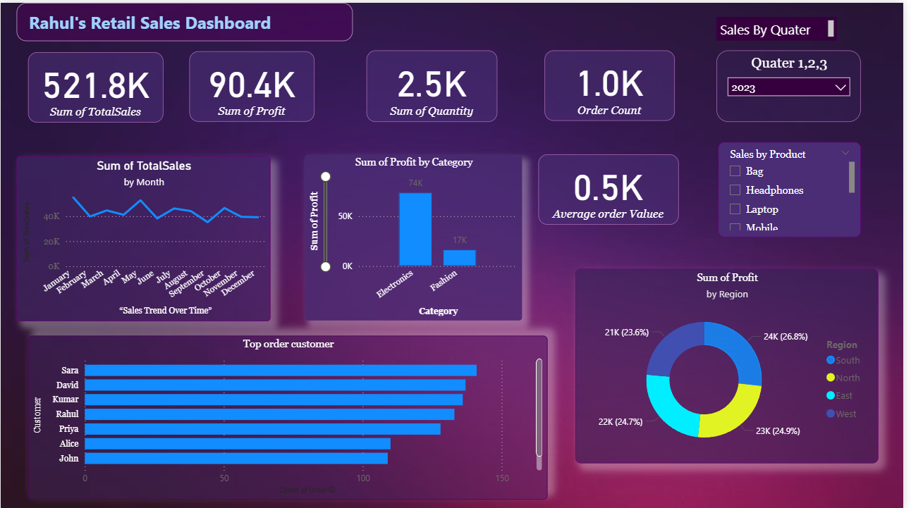

# 🛍️ Retail Sales Data Analysis Using Power BI

This project analyzes retail sales performance using **Power BI** to uncover key business insights such as **revenue trends, customer behavior, product performance, and regional sales distribution**.
## 🧩 Problem Statement
Retail companies often deal with large volumes of sales data across different regions, products, and time periods.  
However, this raw data is difficult to interpret without proper visualization.

Because of that, managers struggle to:
- Identify which products or regions drive the most revenue 🛍️  
- Understand customer purchasing patterns 👥  
- Track profit and sales performance over time 📉  
- Make data-driven business decisions confidently 💼  

---

## 💡 Solution
To solve these challenges, I built an interactive Power BI Dashboard that:
- Consolidates all retail sales data from Excel 📊  
- Cleans, models, and visualizes key performance indicators (KPIs)  
- Provides an easy way to explore trends and performance insights  

This dashboard helps:
- Compare sales, profit, and quantity by region and category  
- Identify top-selling products and low-performing ones  
- Understand monthly/seasonal sales trends  
- Transform raw data into actionable insights for decision-making  

---

## 🎯 Outcome
- Managers can instantly monitor business performance  
- Decisions are now data-driven, not assumption-based  
- Saves time spent on manual reports  
- Clear visibility into growth opportunities and problem areas

---

## 📊 Dashboard Overview
The Power BI dashboard helps visualize:
- Total Sales, Profit, and Quantity by Region
- Top Performing Products
- Customer Purchase Trends
- Monthly and Yearly Sales Comparison
- ## 📊 Dashboard Preview

---

## 🧾 Dataset
The dataset used for this analysis is available here:  
📂 [Retail_Sales_Dataset.xlsx](Retail_Sales_Dataset.xlsx)

---

## 🖥️ Power BI File
You can explore the complete interactive dashboard using this file:  
📊 [Retail_Sales_Dashboard.pbix](Retail_Sales_Dashboard.pbix)

---

## 🧠 Key Insights
- Top-performing region and product category identified  
- Seasonal patterns in sales discovered  
- Improved understanding of customer behavior  
- Actionable insights to enhance marketing and stock planning  

---

## ⚙️ Tools Used
- **Power BI**
- **Microsoft Excel**
-**SQL**
- **Data Cleaning & DAX Measures**

---

## 📌 Conclusion
This dashboard helps transform raw retail data into **actionable insights** that support **data-driven decision-making** and business growth.
